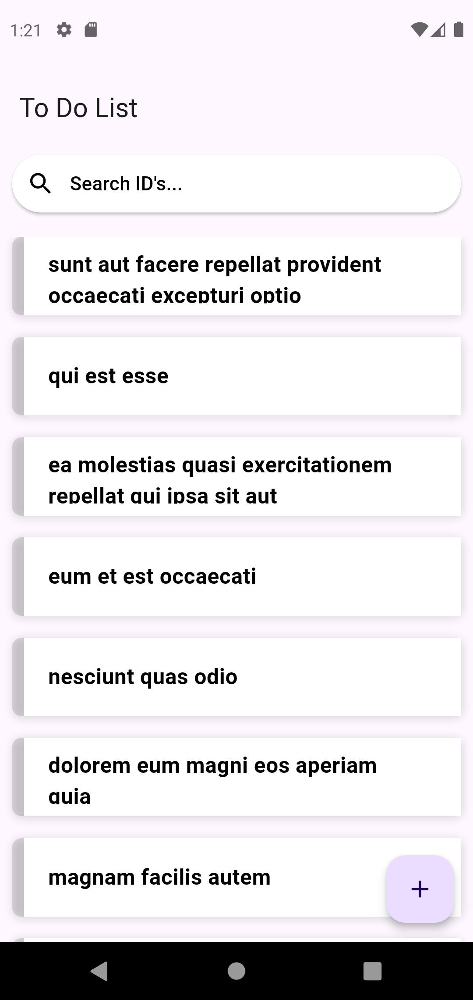
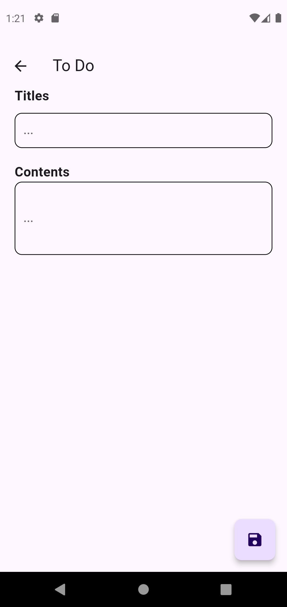
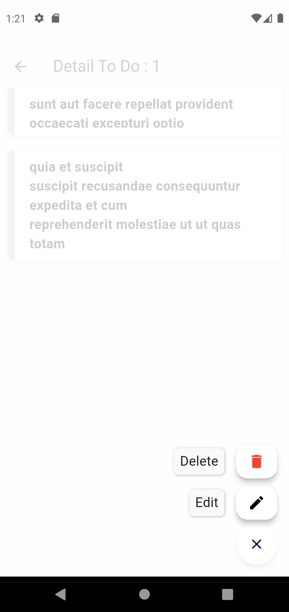
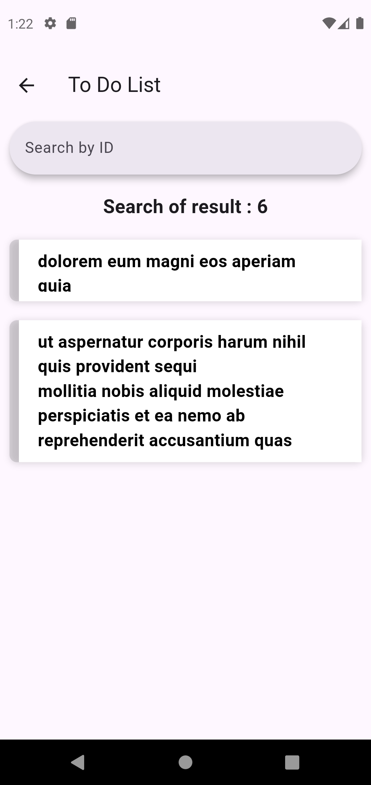

# minimalapp

A new Flutter project.

## Getting Started

### Requirements

- Dart (Channel Stable, version 3.4.4 )
- Flutter (Channel Stable, version 3.22.3 )

1. Clone the repository:

```
git clone 
```

2. Clone the repository:
```
flutter cd minimalapp
```

3. Run the application:
```
flutter run
```
### Screenshots

|   |   |
|---|---|
| | 
| list view  | add form view  |
| | 
| edit view | search id view